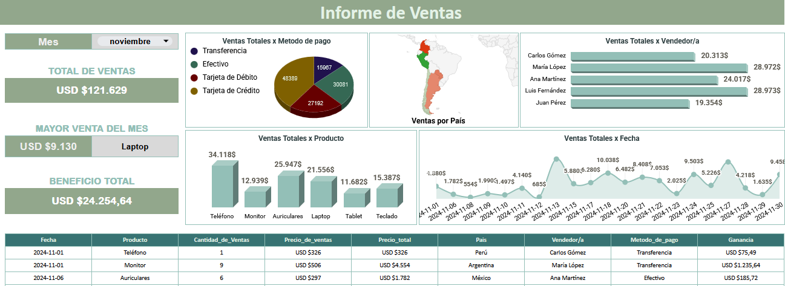
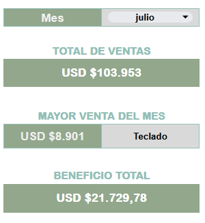

# Registro e Informe de Ventas Mensuales

## Descripción

Este proyecto consiste en un sistema de registro y análisis de ventas mensuales desarrollado en Google Sheets.

Permite centralizar la información de ventas, analizar el desempeño comercial y visualizar métricas clave de forma dinámica mediante un dashboard interactivo.

---

## Herramientas

* Google Sheets
* Fórmulas avanzadas
* Visualización de datos

---

## Estructura de los datos

El sistema se compone de:

* **Reporte de Ventas (500 registros):** base de datos con información detallada de cada transacción
* **Dashboard de Ventas:** panel interactivo para análisis
* **Hoja de soporte:** utilizada para cálculos y automatización

Los datos fueron generados para simular un entorno de ventas en Latinoamérica, permitiendo trabajar con un escenario realista.

---

## KPIs principales

* Total de Ventas
* Mayor venta del mes
* Beneficio total

Estos indicadores se actualizan dinámicamente según el mes seleccionado.

---

## Análisis realizado

* Ventas por método de pago
* Distribución geográfica de ventas
* Desempeño por vendedor
* Productos más vendidos
* Evolución de ventas en el tiempo

---

## Visualizaciones

### Ventas por método de pago

Permite identificar los métodos más utilizados por los clientes.

### Ventas por país

Muestra la distribución geográfica del ingreso.

### Ventas por vendedor

Evalúa el rendimiento del equipo comercial.

### Ventas por producto

Identifica los productos con mayor impacto en ingresos.

### Evolución temporal de ventas

Permite detectar tendencias a lo largo del mes.

---

## Insights

* Algunos métodos de pago predominan sobre otros, lo que puede influir en estrategias comerciales
* Existen diferencias claras en el rendimiento entre vendedores
* Un grupo de productos concentra la mayor parte de las ventas
* Las ventas presentan variaciones a lo largo del tiempo, lo que permite detectar patrones

---

## Recomendaciones

* Potenciar los métodos de pago más utilizados
* Replicar prácticas de los vendedores con mejor desempeño
* Enfocar estrategias en productos más rentables
* Analizar patrones de ventas para mejorar la planificación

---

## Interactividad

El dashboard permite filtrar la información por mes, actualizando automáticamente todos los indicadores y gráficos.

---

## Vista del Dashboard

## Vista de los kpis

## Vista del Reporte de Registros Ventas

---

## Acceso al Dashboard

Puedes ver el archivo en Google Sheets aquí:
[Ver dashboard](https://docs.google.com/spreadsheets/d/16q01RIWGRdH5e3mV-a4mjm_co0_feXJwgVK4NpL_Ii4/edit?usp=sharing)

---

## Conclusión

Este proyecto demuestra cómo organizar, analizar y visualizar datos de ventas para obtener información clara que apoye la toma de decisiones comerciales.
